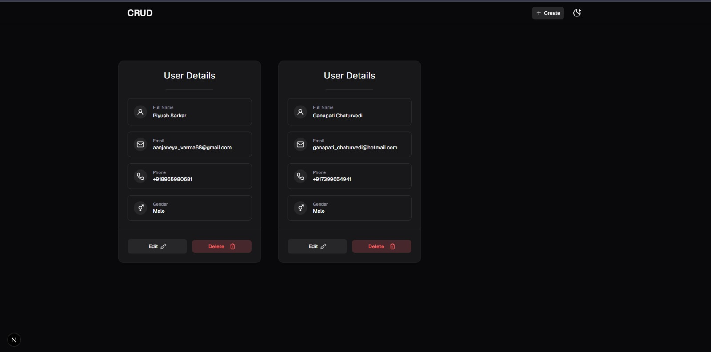
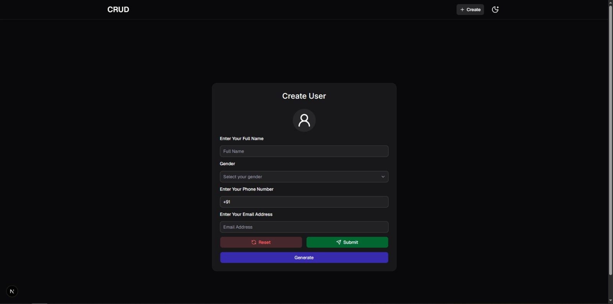
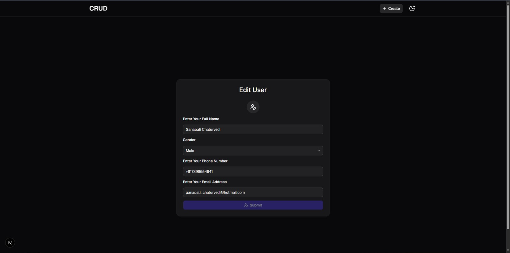

# CRUD DB App




> A polished user management app built with Next.js, Prisma, and SQLite. It demonstrates a complete CRUD workflow with server actions, schema validation, toast feedback, and a responsive dark-mode UI.

## Preview

1. Home Page

   

2. Create User Page

   

3. Edit User Page

   

## About

CRUD DB App is a user management application for creating, reading, updating, and deleting user records stored in a SQLite database through Prisma. The app was built to show a clean full-stack App Router workflow with server components, direct server actions, shared Zod validation, and reusable UI primitives.

It solves a simple but common problem: managing structured user data in a small, fast, modern interface without a separate API layer. This makes it a useful reference for developers who want a practical Next.js + Prisma CRUD starter or a compact example of form-driven server actions.

## Features

- Create users from a client-side form
- Read and list all users on the home page
- Edit existing users by dynamic user ID
- Delete users through a confirmation dialog
- Zod-powered validation on both client and server
- React Hook Form integration
- Toast notifications for success and failure states
- Generate sample user data with Faker
- Empty-state handling when no users exist
- Dark and light theme switching
- Responsive card-based UI
- Server actions instead of route handlers
- Prisma integration with SQLite
- Unique email and phone constraints at the database level
- Revalidation after mutations so the list stays fresh
- Reusable UI primitives built on Base UI and shadcn-style wrappers
- TypeScript throughout the app
- Global font loading with next/font
- Fixed header navigation with quick access to Create

> [!NOTE]
> The repo does not implement authentication, authorization, search, pagination, image upload, optimistic updates, or custom API routes.

## Tech Stack

| Layer                | Technology                                     |
| -------------------- | ---------------------------------------------- |
| Framework            | Next.js 16                                     |
| UI Library           | React 19                                       |
| Language             | TypeScript                                     |
| Styling              | Tailwind CSS 4                                 |
| Component Primitives | Base UI, shadcn/ui-style wrappers              |
| Forms                | React Hook Form                                |
| Validation           | Zod                                            |
| Database ORM         | Prisma 7                                       |
| Database             | SQLite                                         |
| Data Adapter         | `@prisma/adapter-libsql`                       |
| Toasts               | Base UI Toast                                  |
| Theme Switching      | next-themes                                    |
| Icons                | Lucide React                                   |
| Fake Data            | Faker                                          |
| Class Utilities      | clsx, tailwind-merge, class-variance-authority |
| Env Validation       | `@t3-oss/env-nextjs`                           |

## Folder Structure

<details>
<summary>View project tree</summary>

```text
crud-db-app/
├── generated/
│   └── prisma/
├── prisma/
│   ├── migrations/
│   └── schema.prisma
├── public/
│   ├── create-user.jpeg
│   ├── edit-page.jpeg
│   ├── home-page.jpeg
│   └── uploads/
├── src/
│   ├── app/
│   │   ├── [userId]/
│   │   ├── create/
│   │   ├── globals.css
│   │   ├── layout.tsx
│   │   └── page.tsx
│   ├── components/
│   │   ├── Layout/
│   │   ├── Providers/
│   │   ├── customui/
│   │   └── shadcnui/
│   ├── hooks/
│   ├── lib/
│   │   ├── dbClient/
│   │   ├── env/
│   │   ├── fonts.ts
│   │   ├── types.ts
│   │   ├── utils.ts
│   │   └── zodSchema.ts
│   └── server/
├── components.json
├── next.config.ts
├── package.json
├── postcss.config.mjs
├── prisma.config.ts
└── tsconfig.json
```

</details>

## Installation

```bash
npm install
npm run dev
```

## Environment Variables

| Variable                  | Required | Purpose                                                        | Example                |
| ------------------------- | -------- | -------------------------------------------------------------- | ---------------------- |
| `DATABASE_URL`            | Yes      | SQLite connection string used by Prisma and the LibSQL adapter | `file:./prisma/dev.db` |
| `NEXT_TELEMETRY_DISABLED` | No       | Disables Next.js telemetry                                     | `1`                    |
| `CHECKPOINT_DISABLE`      | No       | Disables Prisma checkpoint telemetry                           | `1`                    |

> [!IMPORTANT]
> Client environment variables are not defined in this project. The app only validates server-side environment values.

## Functionality Explanation

### Read Users

The home page is a server component that fetches all users with Prisma, orders them by `id`, and renders `UserDetails` cards. If no records exist, it shows a clear empty state instead of an empty grid.

### Edit User

The dynamic `[userId]` page loads the selected user from Prisma. If the record does not exist, it calls `notFound()`. When the form is submitted, `EditUserForm` sends the values to the `editUser` server action, which validates the payload again, updates the row, revalidates the home page, and returns the user to the list.

### Delete User

`DeleteButton` opens a confirmation dialog before calling the `deleteUser` server action. The action validates the ID, deletes the row, revalidates the home route, and the UI shows a toast for the result.

### Sample Data Generator

`generateUserDetails()` creates realistic fake user data with Faker using Indian locale data. It generates a name, email, `+91` phone number, and normalized gender, which makes form testing faster.

## CRUD Flow

### Create

1. User enters full name, email, phone, and gender.
2. React Hook Form tracks field state and submission state.
3. Zod validates the form on the client and again on the server.
4. `createUser` writes the row with Prisma.
5. `revalidatePath('/')` refreshes the list.
6. A success toast appears and the app returns to `/`.

### Read

1. The home page runs on the server.
2. Prisma fetches all users ordered by `id`.
3. Cards render each record with edit and delete actions.
4. If there are no rows, the app shows `No Data Found`.

### Update

1. The edit page loads the selected user by `id`.
2. The form starts with the current record values.
3. User edits the fields and submits the form.
4. Zod validates the payload again.
5. `editUser` updates the row with Prisma.
6. The home page is revalidated and the user is redirected back to `/`.

### Delete

1. User clicks Delete on a user card.
2. A confirmation dialog appears.
3. `deleteUser` validates the passed ID.
4. Prisma deletes the row.
5. The home page is revalidated.
6. A toast confirms the result.

## Validation

<details>
<summary>Validation rules</summary>

| Field      | Rule                                           | Message                                        |
| ---------- | ---------------------------------------------- | ---------------------------------------------- |
| `fullName` | Minimum 6 characters                           | `Full Name must be at least 6 Characters`      |
| `fullName` | Maximum 35 characters                          | `Full Name must be no more than 35 Characters` |
| `email`    | Must be a valid email address                  | `Invalid Email Address`                        |
| `email`    | Maximum 64 characters                          | `The Value Must Be Under 64 Characters`        |
| `phone`    | Must match `+91` followed by exactly 10 digits | `Follow The Format : +918777XXXXXX`            |
| `gender`   | Required non-empty string                      | `Please Select A Gender`                       |

The same Zod schema is used by both the create and edit forms, and the server actions parse the payload again before touching the database.

</details>

## UI Components

| Component                                                                                  | Purpose                                                            |
| ------------------------------------------------------------------------------------------ | ------------------------------------------------------------------ |
| `Header`                                                                                   | Fixed top navigation with app title, Create link, and theme toggle |
| `ThemeToggleButton`                                                                        | Switches between light and dark modes after mount                  |
| `ThemeProvider`                                                                            | Supplies `next-themes` context and renders the toaster             |
| `CreateForm`                                                                               | Handles user creation, validation, reset, and fake-data generation |
| `EditUserForm`                                                                             | Handles user updates with dirty-state protection                   |
| `DeleteButton`                                                                             | Shows the destructive confirmation flow before deleting            |
| `UserDetails`                                                                              | Displays a single user card and action buttons                     |
| `Field` / `FieldError` / `FieldLabel`                                                      | Accessible form field wrappers and error presentation              |
| `Button`, `Card`, `Input`, `Label`, `Select`, `Separator`, `Badge`, `AlertDialog`, `Toast` | Reusable Base UI / shadcn-style primitives used throughout the app |

## Pages

| Page       | Description                                                                                       |
| ---------- | ------------------------------------------------------------------------------------------------- |
| `/`        | Lists all users from the database or shows an empty state when no records exist                   |
| `/create`  | Displays the create-user form inside a centered card                                              |
| `/:userId` | Loads one user by ID and renders the edit form; shows the 404 fallback if the user does not exist |

## API / Server Actions

There are no route handlers or REST API endpoints in this project. All mutations happen through server actions imported directly into client components.

| Action       | Purpose                      | Input                                          | Output                                 | Usage                    |
| ------------ | ---------------------------- | ---------------------------------------------- | -------------------------------------- | ------------------------ |
| `createUser` | Inserts a new user row       | `{ fullName, email, phone, gender }`           | Success or error object with a message | Called by `CreateForm`   |
| `editUser`   | Updates an existing user row | `userId`, `{ fullName, email, phone, gender }` | Success or error object with a message | Called by `EditUserForm` |
| `deleteUser` | Deletes a user row           | `userId`                                       | Success or error object with a message | Called by `DeleteButton` |

## Database

Prisma is configured for SQLite with a single `User` model.

| Model  | Fields                                       | Notes                                                   |
| ------ | -------------------------------------------- | ------------------------------------------------------- |
| `User` | `id`, `fullName`, `email`, `phone`, `gender` | `id` is the primary key; `email` and `phone` are unique |

There are no relations or secondary models in the current schema.

## Performance

- Prisma Client is cached on `globalThis` during development to avoid duplicate connections.
- The home page and edit page are server components, so data is fetched on the server instead of the browser.
- `revalidatePath('/')` keeps the list view current after create, edit, and delete operations.
- The theme toggle waits until mount before reading theme state, which helps avoid hydration mismatches.
- Fonts are loaded through `next/font` instead of a runtime font loader.

## Security

- Inputs are validated in the form layer and again inside the server actions.
- Prisma unique constraints protect `email` and `phone` at the database level.
- The delete action validates the user ID before performing the mutation.
- The app does not expose custom API routes, so the only mutation surface is the server-action layer.
- There is no authentication, authorization, or rate limiting in the current codebase.

## Future Improvements

- Add search and filtering for the user list
- Add pagination for larger datasets
- Add authentication and authorization
- Add optimistic UI updates for mutations
- Add richer empty and loading states
- Add upload support for profile images
- Add tests for server actions and form validation
- Add seed scripts for repeatable demo data

## Contributing

Contributions are welcome.

1. Fork the repository.
2. Create a branch for your change.
3. Make the update and keep it consistent with the existing code style.
4. Run the relevant checks locally.
5. Open a pull request with a clear description of the change.

> [!TIP]
> Keep changes focused and avoid introducing features that are not already aligned with the current CRUD scope unless they are part of a deliberate enhancement.

## License

This project is licensed under the MIT License. See [LICENSE](./LICENSE) for details.

## 👨‍💻 Author

**Piyush Sarkar**

GitHub: https://github.com/piyushsarkar-dev/crud-db-app

Email: hi.mrpiyush@gmail.com

## Acknowledgements

- Next.js for the App Router, server components, and build tooling
- Prisma for the typed database client and migrations
- Zod for schema validation
- React Hook Form for ergonomic form state management
- Base UI for accessible primitive components
- shadcn-style component composition for the local UI layer
- Lucide React for the icon set
- Faker for realistic demo data generation
- next-themes for theme persistence and switching
